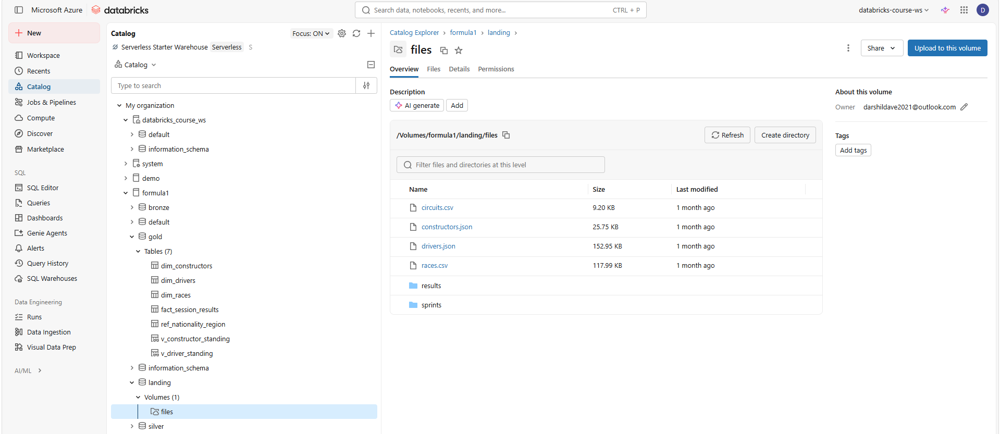
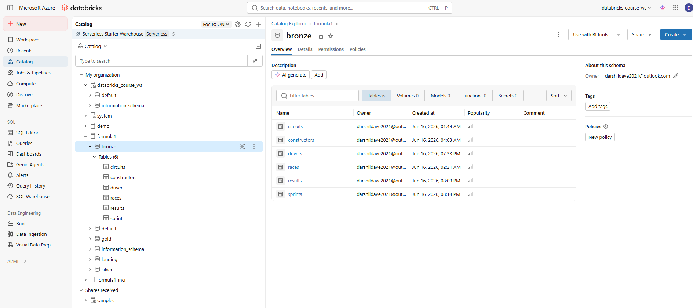
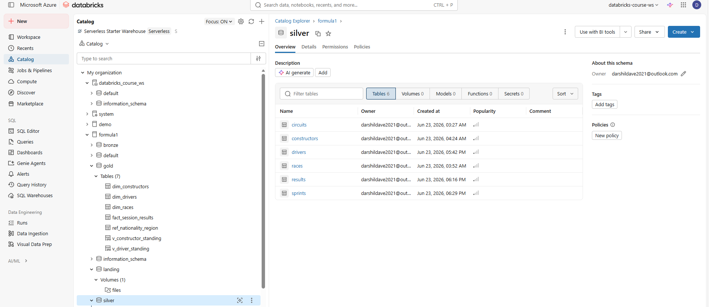
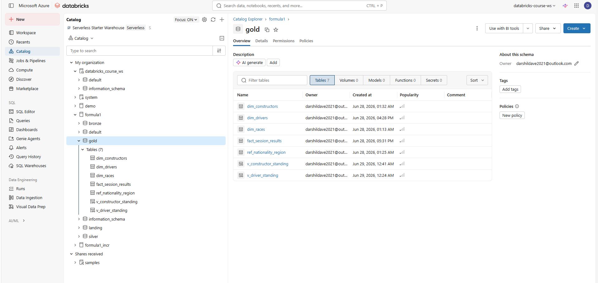
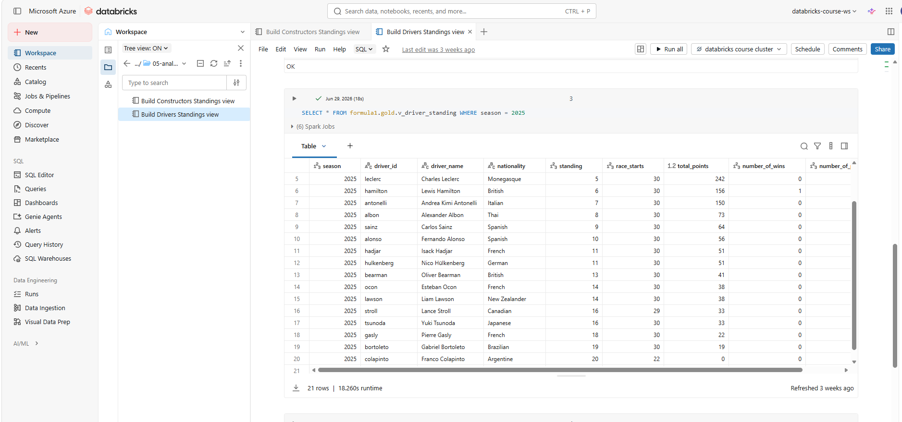
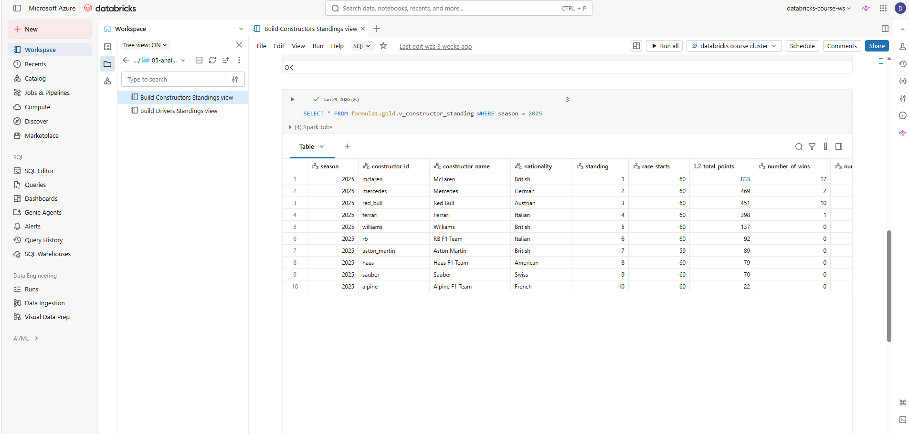
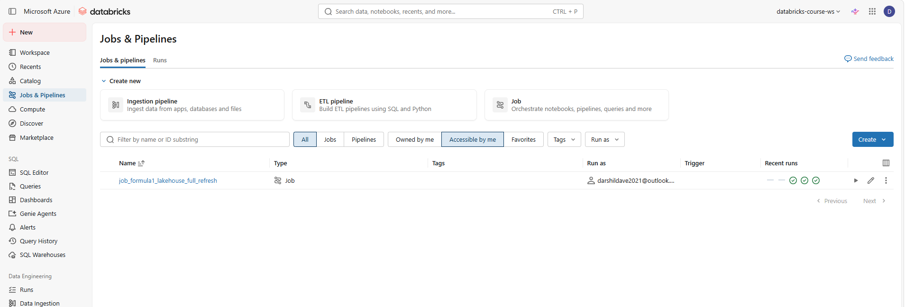
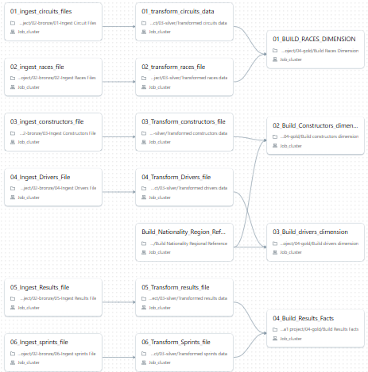

# 🏎️ Formula 1 Data Engineering Project using Azure Databricks

An end-to-end Data Engineering project built on the Azure Databricks Lakehouse Platform that implements the **Medallion Architecture (Landing → Bronze → Silver → Gold)** to ingest, transform, and analyze Formula 1 racing datasets.

The project demonstrates modern Data Engineering practices using **PySpark**, **Delta Lake**, **Unity Catalog**, **Azure Data Lake Storage Gen2 (ADLS Gen2)**, and **Databricks Workflows** to build a scalable and maintainable data pipeline.

---

# 🚀 Technology Stack

- Azure Databricks
- PySpark
- Delta Lake
- Azure Data Lake Storage Gen2 (ADLS Gen2)
- Unity Catalog
- Azure Access Connector
- Databricks Workflows
- SQL
- Git & GitHub

---

# ⭐ Project Highlights

- End-to-End Data Engineering Pipeline
- Azure Databricks Lakehouse Platform
- Medallion Architecture (Landing → Bronze → Silver → Gold)
- Delta Lake
- Unity Catalog
- PySpark Transformations
- Incremental Data Processing
- Databricks Job Orchestration
- Reusable Notebook Design
- Data Quality & Validation
- Driver & Constructor Analytics
- Dimensional Data Modeling

---

# 🏗️ Solution Architecture


The solution follows the Medallion Architecture where raw data is progressively refined into business-ready datasets.

| Layer | Description |
|--------|-------------|
| Landing | Raw source files stored in Azure Data Lake Storage |
| Bronze | Raw Delta tables with schema enforcement |
| Silver | Cleaned, standardized and transformed data |
| Gold | Curated analytical datasets for reporting |

---

# ☁️ Data Architecture


The project uses Azure Data Lake Storage Gen2 as the storage layer while Unity Catalog provides centralized governance through Storage Credentials and External Locations.

---

# 🔐 Secure Cloud Storage Configuration


Azure Databricks securely connects to Azure Data Lake Storage Gen2 using:

- Azure Access Connector
- Storage Blob Data Contributor Role
- Storage Credentials
- External Locations
- Unity Catalog

---

# 📊 Entity Relationship Diagram


The Gold layer follows a dimensional data model that establishes relationships between Drivers, Constructors, Circuits, Races, Results, Pit Stops, Qualifying, Sprint Results, and Lap Times to support analytical reporting.

---

# 📋 Project Overview


The pipeline ingests raw Formula 1 datasets into the Landing layer, processes them through Bronze and Silver layers, and produces curated Gold-layer datasets for business analytics.

---

# 📁 Source Data


The project processes multiple Formula 1 datasets in CSV and JSON formats.

Datasets include:

- Circuits
- Constructors
- Drivers
- Races
- Results
- Pit Stops
- Lap Times
- Qualifying
- Sprint Results

---

# 🥉 Bronze Layer Requirements


The Bronze layer is responsible for:

- Reading raw source files
- Schema enforcement
- Handling multiline JSON files
- Adding ingestion timestamps
- Loading data into Delta Lake
- Preserving raw data for downstream processing

---

# 🥈 Silver Layer Requirements


The Silver layer performs:

- Data cleansing
- Data standardization
- Column transformations
- Business rule implementation
- Data quality improvements
- Incremental processing

---

# 📥 Landing Layer



The Landing layer stores raw Formula 1 source datasets exactly as received in Azure Data Lake Storage Gen2. It acts as the entry point for the pipeline and preserves the original files for traceability and reprocessing.

---

# 🥉 Bronze Layer



The Bronze layer ingests raw source data into Delta tables with schema enforcement and audit columns. It provides a reliable foundation for downstream transformations.

---

# 🥈 Silver Layer



The Silver layer contains cleansed and standardized datasets where business rules, transformations, and data quality checks are applied.

---

# 🥇 Gold Layer



The Gold layer contains business-ready datasets optimized for analytical reporting and downstream consumption.

---

# 🏁 Driver Standings Analytics



Driver standings are calculated by aggregating race results across the season to determine championship points and rankings for each driver.

---

# 🏎️ Constructor Standings Analytics



Constructor standings combine driver performance to calculate team rankings and championship standings throughout the season.

---

# 🔄 Databricks Job Orchestration



The complete pipeline is orchestrated using Databricks Jobs. The workflow automates notebook execution, ensuring each stage of the Medallion Architecture runs in the correct sequence.

---

# ⚙️ Job Tasks



The Databricks Job is divided into dependent tasks representing each stage of the ETL pipeline. Task dependencies ensure successful execution from Landing through Bronze, Silver, and Gold layers.

---

# 📂 Repository Structure

```text
formula1-databricks-data-engineering/
│
├── notebooks/
│   ├── bronze/
│   ├── silver/
│   ├── gold/
│   └── includes/
│
├── sample_data/
│
├── screenshots/
│
├── docs/
│   ├── setup-guide.md
│   ├── project-flow.md
│   └── notebook-execution-order.md
│
├── README.md
├── requirements.txt
├── LICENSE
└── .gitignore
```

---

# ▶️ Execution Flow

```text
Landing Layer
      │
      ▼
Bronze Layer
      │
      ▼
Silver Layer
      │
      ▼
Gold Layer
      │
      ▼
Analytics & Reporting
```

---

# 🎯 Learning Outcomes

This project demonstrates practical experience with:

- Azure Databricks
- PySpark
- Delta Lake
- Azure Data Lake Storage Gen2
- Unity Catalog
- Databricks Workflows
- Data Engineering Best Practices
- Medallion Architecture
- ETL Pipeline Development
- Data Modeling
- Analytical Data Processing

---

# 👨‍💻 Author

**Darshil Dave**

**Data Engineer | BI Engineering Lead | Azure Databricks | PySpark | SQL | Power BI**

If you found this project useful, feel free to ⭐ the repository.
