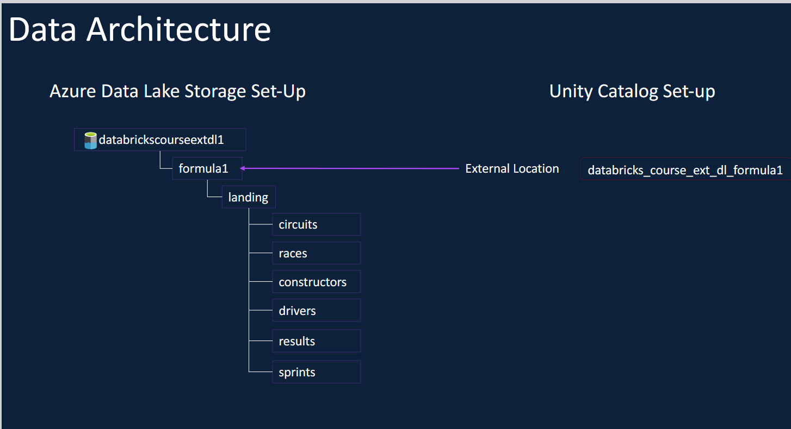
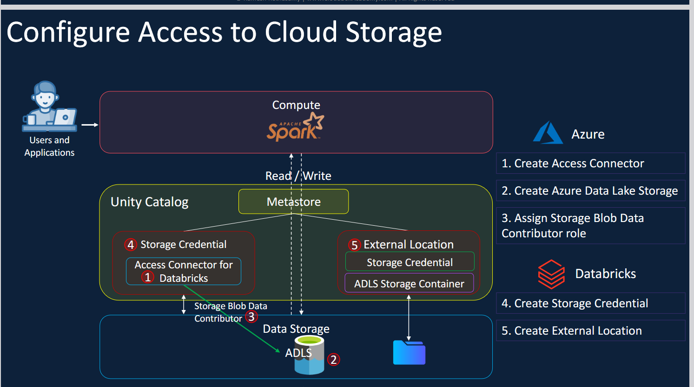
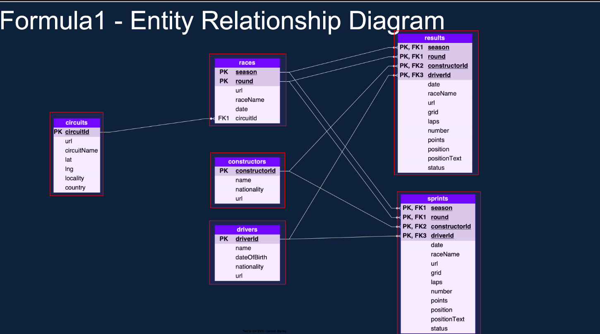
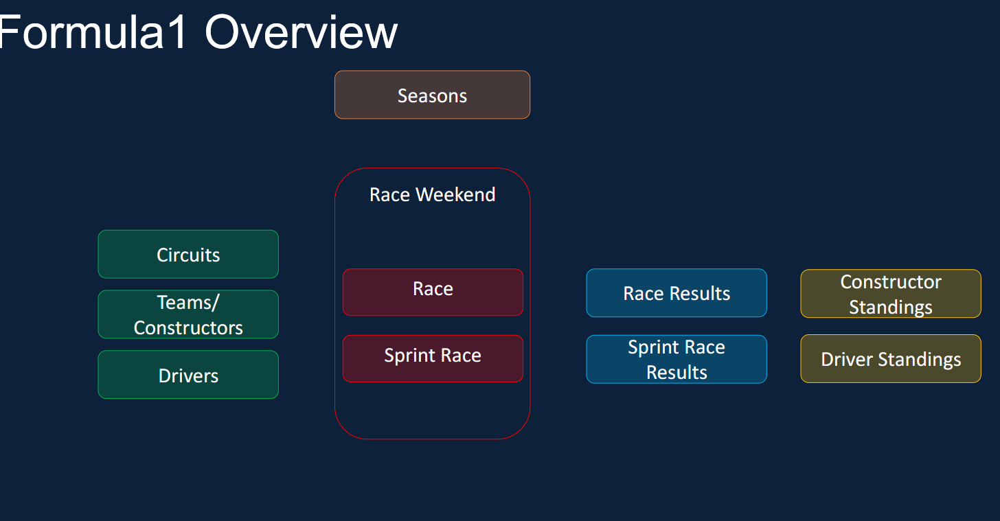
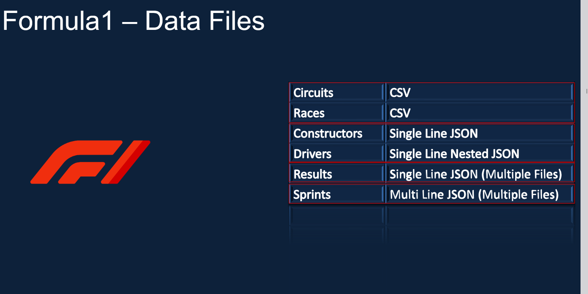
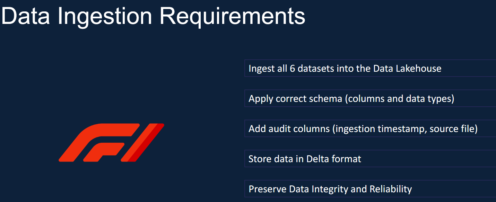
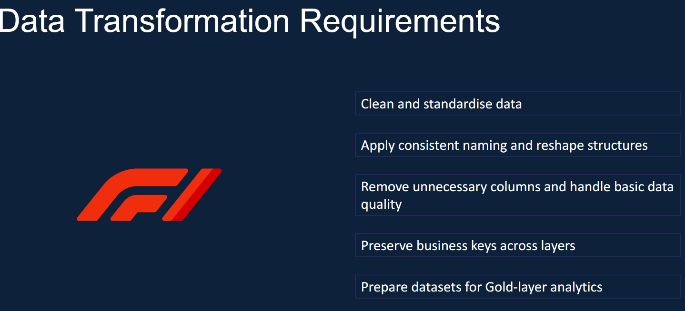

# 🏎️ Formula 1 Data Engineering Project using Azure Databricks

## 📖 Project Overview

This project demonstrates the design and implementation of an end-to-end Data Engineering pipeline using the Azure Databricks Lakehouse Platform. The solution follows the Medallion Architecture (Bronze, Silver, and Gold) to ingest, transform, and curate Formula 1 racing datasets stored in Azure Data Lake Storage Gen2.

The project showcases modern data engineering practices, including Delta Lake, Unity Catalog, Databricks Workflows, reusable PySpark notebooks, and dimensional modeling for analytical reporting.

---

## 🚀 Technology Stack

- Azure Databricks
- PySpark
- Delta Lake
- Azure Data Lake Storage Gen2 (ADLS Gen2)
- Unity Catalog
- Azure Access Connector
- Databricks Workflows
- SQL
- Git & GitHub

---

# 🏗️ Solution Architecture


The project follows the Medallion Architecture to progressively improve data quality and prepare business-ready datasets.

### Data Flow

Landing → Bronze → Silver → Gold

| Layer | Purpose |
|--------|----------|
| Landing | Raw source files stored in Azure Data Lake Storage |
| Bronze | Raw ingestion with schema enforcement and audit columns |
| Silver | Data cleansing, standardization, and transformations |
| Gold | Curated analytical datasets for reporting and dashboards |

---

# ☁️ Data Architecture



Azure Data Lake Storage Gen2 serves as the central storage layer for this project. Unity Catalog provides centralized governance through Storage Credentials, External Locations, and fine-grained access control.

---

# 🔐 Secure Cloud Storage Configuration



The project securely connects Azure Databricks with Azure Data Lake Storage Gen2 using:

- Azure Access Connector
- Storage Blob Data Contributor Role
- Unity Catalog Storage Credential
- External Location

This setup enables secure and governed access to cloud storage.

---

# 📊 Formula 1 Entity Relationship Diagram



The Gold layer is designed using a dimensional data model.

The model establishes relationships between:

- Drivers
- Constructors
- Circuits
- Races
- Results
- Sprint Results

This schema supports efficient analytical queries and reporting.

---

# 📂 Project Overview



The pipeline ingests Formula 1 datasets into the Bronze layer, transforms them in the Silver layer, and produces curated Gold-layer datasets for analytics, including Driver Standings and Constructor Standings.

---

# 📁 Source Data



The project processes multiple Formula 1 datasets in CSV and JSON formats.

Datasets include:

- Circuits
- Drivers
- Constructors
- Races
- Results
- Pit Stops
- Lap Times
- Qualifying
- Sprint Results

---

# 🥉 Bronze Layer - Data Ingestion



The Bronze layer is responsible for:

- Reading raw source files
- Applying predefined schemas
- Handling multiline JSON files
- Adding ingestion timestamps
- Loading data into Delta tables
- Preserving raw data for downstream processing

---

# 🥈 Silver Layer - Data Transformation



The Silver layer performs:

- Data cleansing
- Standardization
- Column renaming
- Derived column creation
- Data quality improvements
- Business rule implementation
- Incremental processing

---

# ⭐ Key Features

- End-to-End Data Engineering Pipeline
- Azure Databricks Lakehouse
- Medallion Architecture
- PySpark Transformations
- Delta Lake Storage
- Unity Catalog Governance
- Incremental Data Loading
- Reusable Parameterized Notebooks
- Modular Code Structure
- Audit Columns
- Dimensional Data Modeling
- Databricks Workflows

---

# 📂 Repository Structure

```text
formula1-databricks-data-engineering
│
├── notebooks
│   ├── bronze
│   ├── silver
│   ├── gold
│   └── includes
│
├── sample_data
│
├── screenshots
│
├── README.md
├── LICENSE
└── .gitignore
```

---

# 🎯 Learning Outcomes

This project demonstrates practical experience with:

- Azure Databricks
- PySpark
- Delta Lake
- Azure Data Lake Storage Gen2
- Unity Catalog
- Data Modeling
- ETL Pipeline Development
- Lakehouse Architecture
- Data Engineering Best Practices

---

## 👨‍💻 Author

**Darshil Dave**

Data Engineer | BI Engineering Lead | Azure Databricks | PySpark | SQL | Power BI
