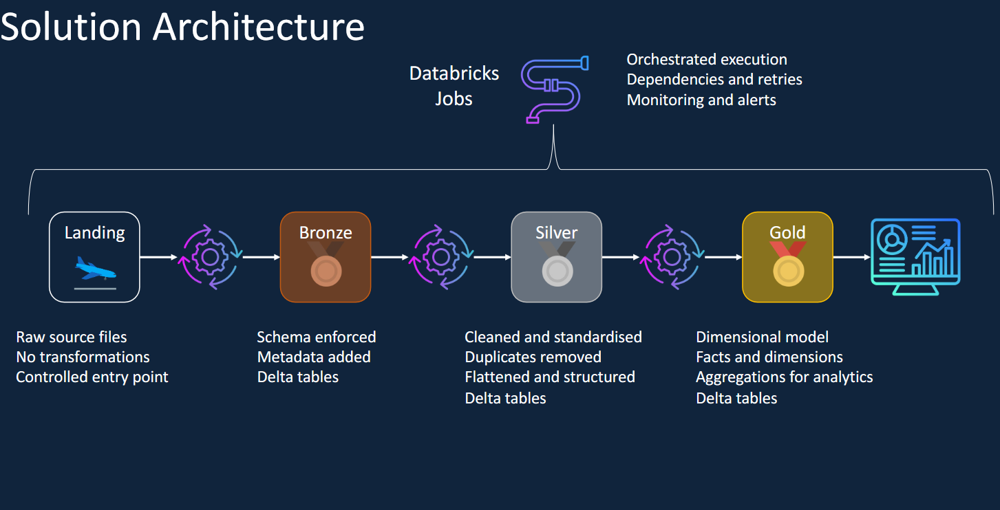

# 🏎️ Formula 1 Data Engineering Project using Azure Databricks

An end-to-end Data Engineering project built on the Azure Databricks Lakehouse Platform implementing the Medallion Architecture (Bronze, Silver, Gold) to ingest, transform, and analyze Formula 1 race data.

## 🚀 Tech Stack

- Azure Databricks
- PySpark
- Delta Lake
- Unity Catalog
- Azure Data Lake Storage Gen2 (ADLS Gen2)
- Databricks Workflows
- Git & GitHub

---

## 📌 Project Architecture

This project follows the Medallion Architecture:

- **Landing** – Raw source files stored in Azure Data Lake Storage.
- **Bronze** – Data ingestion with schema enforcement and audit columns.
- **Silver** – Data cleansing, standardization, and transformations.
- **Gold** – Analytical tables for reporting and business insights.

---
